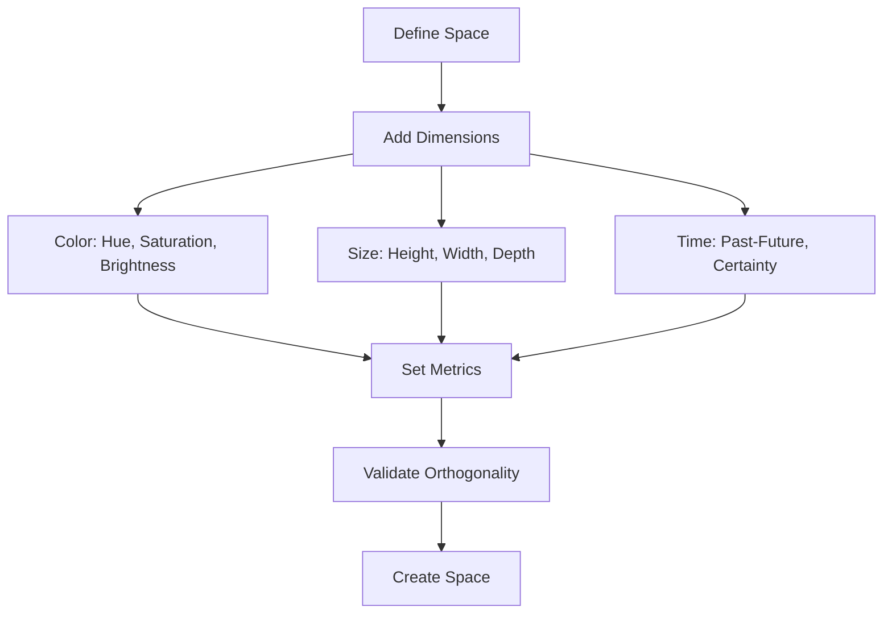
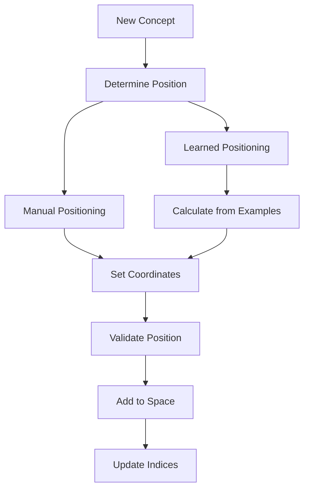
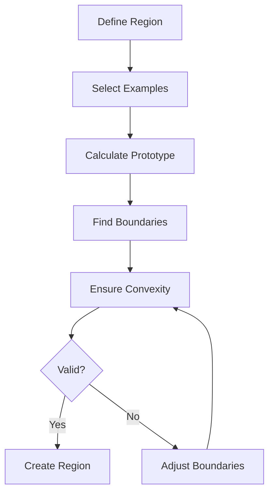
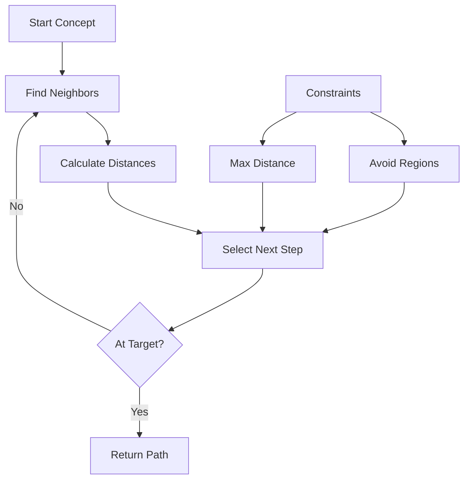
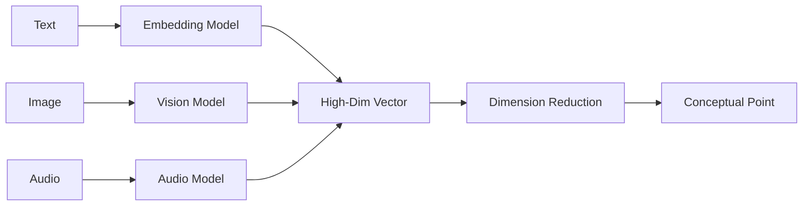
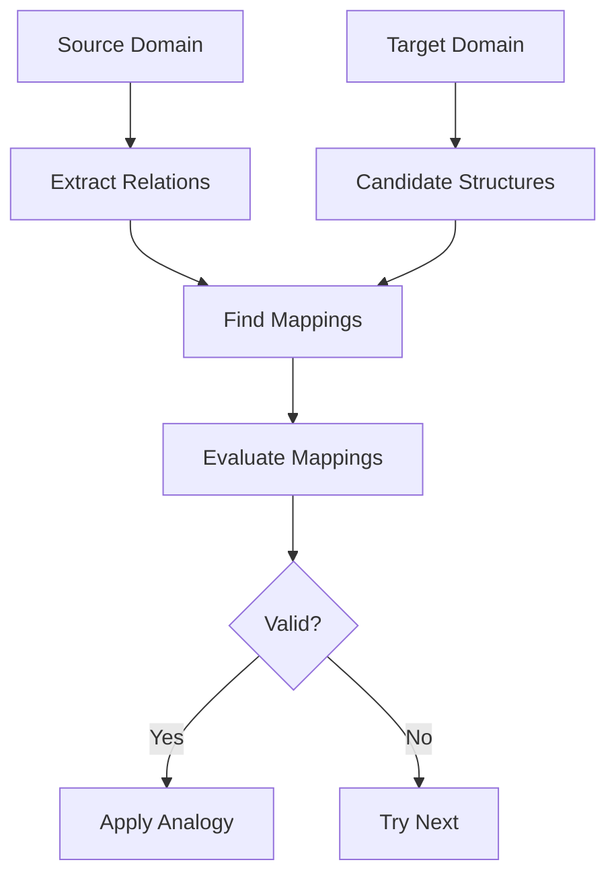

# User Stories for Conceptual Spaces Domain

## Overview

User stories for the Conceptual Spaces domain module, which implements Gärdenfors' theory of conceptual spaces for semantic reasoning, similarity measurement, and knowledge representation in the CIM system.

## Conceptual Space Creation

### Story CS1: Create Conceptual Space
**As a** knowledge engineer  
**I want** to create a conceptual space  
**So that** semantic relationships can be modeled

**Acceptance Criteria:**
- Space created with quality dimensions
- ConceptualSpaceCreated event generated
- Dimension types (continuous, ordinal, circular)
- Metric specification per dimension
- Validation of dimension orthogonality

**Mermaid Diagram:**

**Tests:** `test_create_conceptual_space`, `test_dimension_validation`

### Story CS2: Define Quality Dimensions
**As a** domain expert  
**I want** to define quality dimensions  
**So that** domain properties are captured

**Acceptance Criteria:**
- Dimension properties specified
- DimensionDefined event generated
- Range and scale definition
- Measurement units
- Perceptual vs conceptual dimensions

**Tests:** `test_define_dimensions`, `test_dimension_properties`

### Story CS3: Configure Distance Metrics
**As a** knowledge engineer  
**I want** to configure distance metrics  
**So that** similarity is measured appropriately

**Acceptance Criteria:**
- Multiple metric types (Euclidean, Manhattan, Minkowski)
- MetricConfigured event generated
- Weighted dimensions
- Context-sensitive metrics
- Custom metric functions

**Tests:** `test_configure_metrics`, `test_weighted_distance`

## Concept Management

### Story CS4: Add Concepts to Space
**As a** knowledge curator  
**I want** to add concepts to the space  
**So that** knowledge is represented

**Acceptance Criteria:**
- Concept positioned in space
- ConceptAdded event generated
- Coordinate validation
- Metadata attachment
- Batch concept import

**Mermaid Diagram:**

**Tests:** `test_add_concept`, `test_position_validation`

### Story CS5: Move Concepts
**As a** knowledge engineer  
**I want** to move concepts in space  
**So that** representations can be refined

**Acceptance Criteria:**
- Concept position updated
- ConceptMoved event generated
- Movement history tracked
- Constraint satisfaction
- Batch movements

**Tests:** `test_move_concept`, `test_movement_constraints`

### Story CS6: Remove Concepts
**As a** knowledge curator  
**I want** to remove concepts  
**So that** outdated knowledge is cleaned

**Acceptance Criteria:**
- Concept removed from space
- ConceptRemoved event generated
- Cascade to dependent concepts
- Archive option
- Undo capability

**Tests:** `test_remove_concept`, `test_cascade_removal`

## Region Management

### Story CS7: Define Convex Regions
**As a** domain expert  
**I want** to define convex regions  
**So that** categories are represented

**Acceptance Criteria:**
- Convex region boundaries defined
- RegionDefined event generated
- Prototype point identified
- Member concepts tracked
- Boundary validation

**Mermaid Diagram:**

**Tests:** `test_define_region`, `test_convexity_check`

### Story CS8: Test Region Membership
**As a** system  
**I want** to test region membership  
**So that** categorization works

**Acceptance Criteria:**
- Point-in-region testing
- MembershipTested event generated
- Fuzzy membership degrees
- Multiple region handling
- Performance optimization

**Tests:** `test_region_membership`, `test_fuzzy_membership`

### Story CS9: Merge Regions
**As a** knowledge engineer  
**I want** to merge similar regions  
**So that** categories are simplified

**Acceptance Criteria:**
- Region merging algorithm
- RegionsMerged event generated
- Prototype recalculation
- Member reassignment
- Merge criteria configuration

**Tests:** `test_merge_regions`, `test_prototype_update`

## Similarity and Search

### Story CS10: Find Similar Concepts
**As a** user  
**I want** to find similar concepts  
**So that** related knowledge is discovered

**Acceptance Criteria:**
- K-nearest neighbor search
- SimilaritySearched event generated
- Threshold-based search
- Multiple space search
- Result ranking

**Tests:** `test_similarity_search`, `test_knn_performance`

### Story CS11: Calculate Concept Similarity
**As a** system  
**I want** to calculate concept similarity  
**So that** relationships are quantified

**Acceptance Criteria:**
- Pairwise similarity calculation
- SimilarityCalculated event generated
- Normalized scores (0-1)
- Asymmetric similarity
- Explanation generation

**Tests:** `test_similarity_calculation`, `test_similarity_symmetry`

### Story CS12: Find Path Between Concepts
**As a** user  
**I want** to find paths between concepts  
**So that** relationships are understood

**Acceptance Criteria:**
- Shortest path in conceptual space
- PathFound event generated
- Waypoint support
- Path constraints
- Multiple path options

**Mermaid Diagram:**

**Tests:** `test_pathfinding`, `test_path_constraints`

## Learning and Adaptation

### Story CS13: Learn from Examples
**As a** system  
**I want** to learn concept positions  
**So that** space adapts to data

**Acceptance Criteria:**
- Example-based learning
- ConceptLearned event generated
- Incremental learning
- Validation set handling
- Learning rate control

**Tests:** `test_concept_learning`, `test_incremental_update`

### Story CS14: Adapt Dimension Weights
**As a** system  
**I want** to adapt dimension weights  
**So that** importance is learned

**Acceptance Criteria:**
- Weight optimization
- WeightsAdapted event generated
- Feedback incorporation
- Regularization options
- Cross-validation

**Tests:** `test_weight_adaptation`, `test_weight_regularization`

### Story CS15: Discover Regions
**As a** system  
**I want** to discover natural regions  
**So that** categories emerge

**Acceptance Criteria:**
- Clustering algorithms
- RegionsDiscovered event generated
- Density-based discovery
- Hierarchical regions
- Quality metrics

**Tests:** `test_region_discovery`, `test_clustering_quality`

## Integration Features

### Story CS16: Map to Embeddings
**As a** developer  
**I want** to map embeddings to conceptual space  
**So that** ML models integrate

**Acceptance Criteria:**
- Embedding transformation
- EmbeddingMapped event generated
- Dimension reduction
- Inverse mapping
- Multiple embedding types

**Mermaid Diagram:**

**Tests:** `test_embedding_mapping`, `test_dimension_reduction`

### Story CS17: Export Space Visualization
**As a** user  
**I want** to export space visualizations  
**So that** insights are shared

**Acceptance Criteria:**
- 2D/3D projections
- VisualizationExported event generated
- Interactive formats
- Annotation support
- Multiple export formats

**Tests:** `test_space_visualization`, `test_projection_quality`

### Story CS18: Synchronize Spaces
**As a** system architect  
**I want** to synchronize multiple spaces  
**So that** knowledge is consistent

**Acceptance Criteria:**
- Cross-space mapping
- SpacesSynchronized event generated
- Conflict resolution
- Bidirectional sync
- Version control

**Tests:** `test_space_synchronization`, `test_conflict_resolution`

## Analysis and Reasoning

### Story CS19: Analyze Concept Drift
**As an** analyst  
**I want** to analyze concept drift  
**So that** changes are detected

**Acceptance Criteria:**
- Temporal position tracking
- ConceptDriftDetected event generated
- Drift metrics
- Alert thresholds
- Visualization support

**Tests:** `test_drift_detection`, `test_drift_metrics`

### Story CS20: Perform Analogical Reasoning
**As a** reasoning system  
**I want** to perform analogies  
**So that** knowledge transfers

**Acceptance Criteria:**
- Structure mapping
- AnalogyFound event generated
- Relation preservation
- Confidence scoring
- Multiple analogies

**Mermaid Diagram:**

**Tests:** `test_analogical_reasoning`, `test_structure_mapping`

## Legend

- 🧠 Core conceptual space operations
- 📐 Geometric and mathematical features
- 🔍 Search and similarity
- 📊 Learning and adaptation

## Test Coverage Requirements

- Unit tests for all space operations
- Integration tests for learning algorithms
- Performance tests for high-dimensional spaces
- Accuracy tests for similarity measures
- Validation tests for mathematical properties 